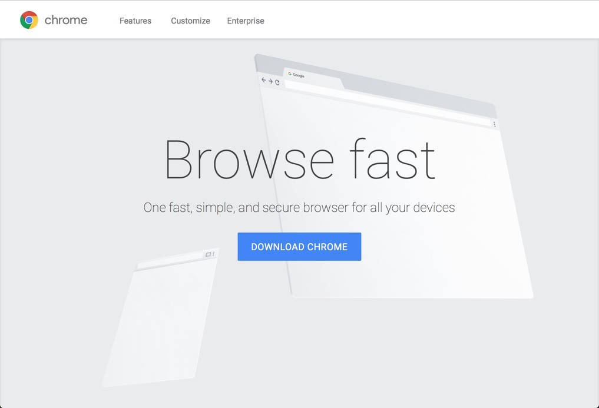
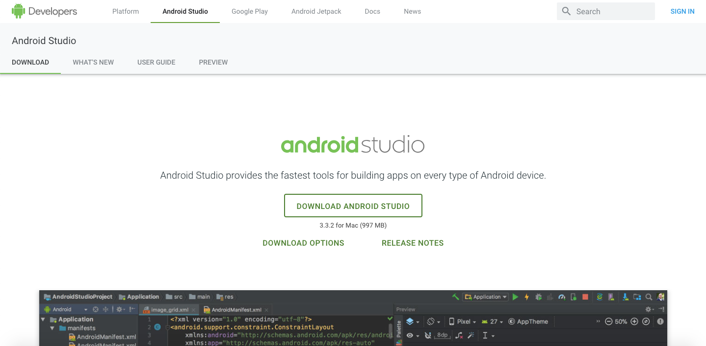

# 1. Configurando el ambiente

Antes de arrancar, se necesitan tener las herramientas instaladas. No hay restricciones con respecto al sistema operativo (_Windows, Linux o Mac_) y al browser (_Microsoft Edge, Chrome, Safari, Firefox, etc._), aunque se instalará Chrome para asegurar tener la misma experiencia en el transcurso del workshop sin depender del sistema operativo. 

Se requiere instalar _Android Studio_. y una cuenta en google para el workshop.

A continuación, se explica cómo instalar alguna de ellas.

## Instalar Chrome última versión

El workshop se basa en estándares web que para el momento de creación del mismo no estaban completamente implementadas en todos los browsers. Por eso, más la posibilidad de tener la misma experiencia en todos los sistemas operativos, agregamos como prerrequisito tener la última versión de Chrome instalada. Hay que aclarar que nada de lo que hagamos no impedirá que el sitio funcione en los browsers que no tengan soporte para alguna funcionalidad.

1. Navegar a [https://www.google.com/chrome/](https://www.google.com/chrome/) y descargar la versión correspondiente para tu plataforma.

    

    _Sitio de Chrome_

1. Una vez descargado, seguir los pasos de la instalación.

## Instalar Android Studio

Para editar el código y correr los demos se utilizara _Android Studio_, es gratuito. Igualmente, se puede usar su editor de texto o IDE preferido.

1. Navegar a [https://developer.android.com/studio](https://developer.android.com/studio) y descargar la versión correspondiente para tu plataforma.

    

    _Sitio de developer Android_

## Próximo Paso
Avanzar al [crear cuenta firebase](../02-firebaseConfig)