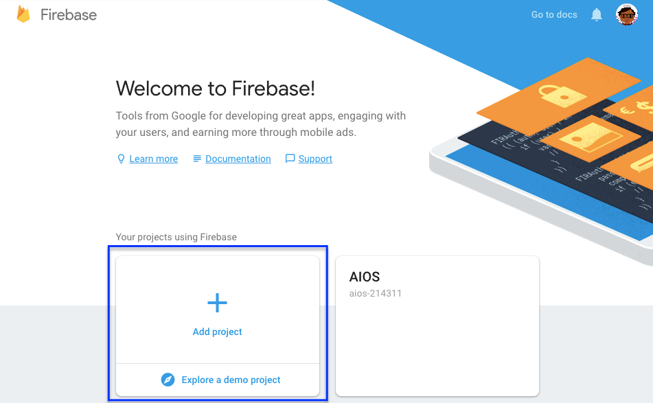
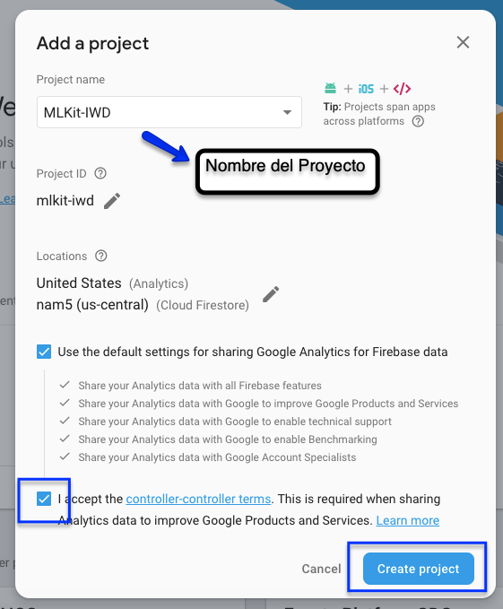
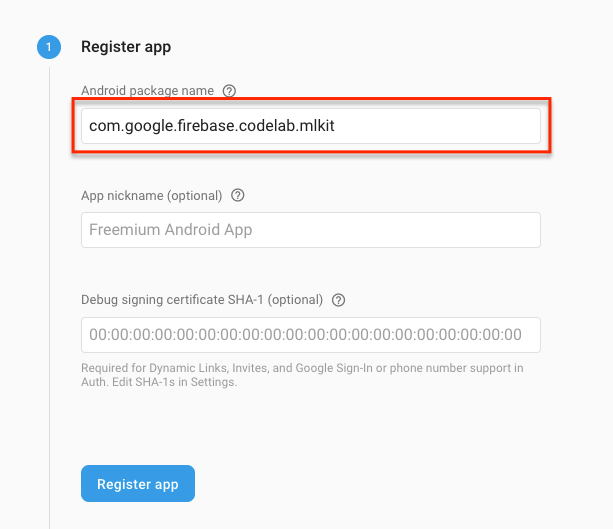
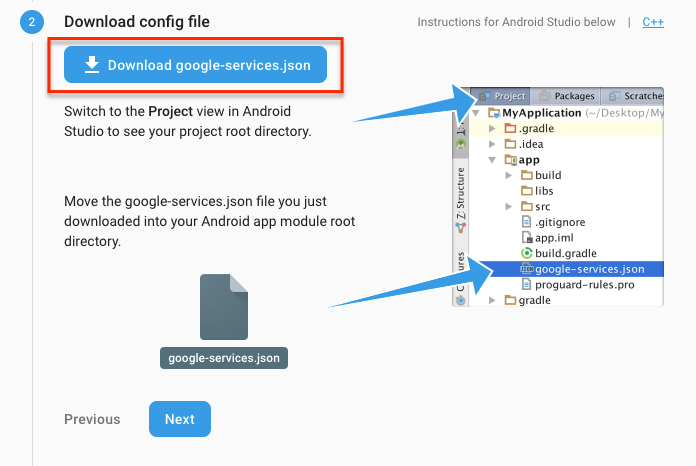

# 2. Creando una cuenta en firebase

## Crear un proyecto en firebase

lo primero que vamos a hacer es crear un nuevo proyecto y lo haremos de la siguiente manera:

1. Primero ingresar a [firebase](https://firebase.google.com/) y dar clicke en el boton `GET STARTED` o `COMENZAR`

```
asegurate de estar con tu cuenta google como el recuadro azul
```


2. el siguiente paso sera crear un nuevo proyecto






## Conectar Firebase con Android

Ahora necesitamos obtener el ***`google-services.json`*** que lo haremos de la siguiente manera:

Conectaremos nuestro proyecto firebase con el proyecto de android...


Ahora agregamos ***`com.google.firebase.codelab.mlkit`*** en `android package name` y registramos la app.


Por ultimo descargamos el archivo  ***`google-services.json`*** y lo agregamos donde nos indica la imagen.


> **Nota**: Configuramos el proyecto en el siguiente paso.

## Correr el proyecto starter en Android Studio

Ahora que tenemos nuestro proyecto en firebase, el siguiente paso sera crear un proyecto en Android Studio.

El primer paso sera abrir _Android Studio_ en la lista de aplicaciones, abrir proyecto y abrir la carpeta `starter`.

copiar en la carpeta `app` el archivo `google-services.json` del paso anterior.

## Próximo modulo
Avanzar al [correr aplicacion](../03-runAndroid)