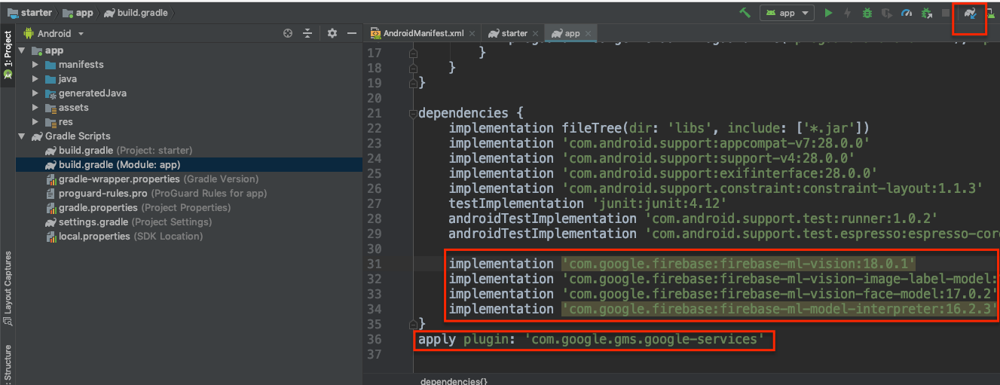
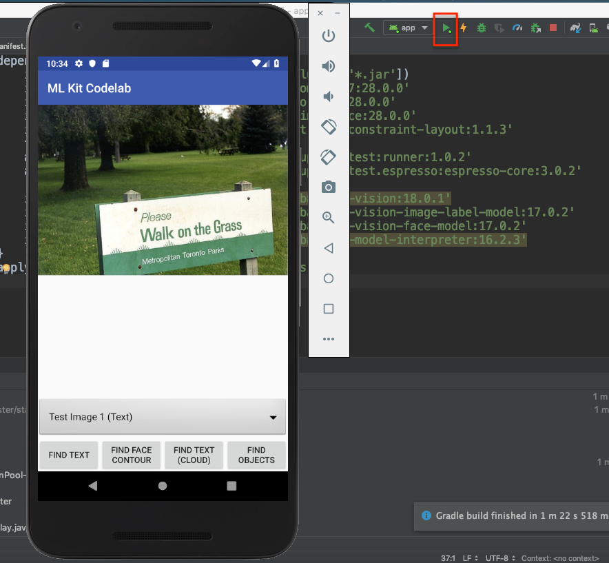

# 2. Correr aplicacion en android

ingresar al archivo `build.glade` dentro de `app` y verificar las siguientes librerias esten dentro de `dependencies`

```
implementation 'com.google.firebase:firebase-ml-vision:18.0.1'
implementation 'com.google.firebase:firebase-ml-vision-image-label-model:17.0.2'
implementation 'com.google.firebase:firebase-ml-vision-face-model:17.0.2'
implementation 'com.google.firebase:firebase-ml-model-interpreter:16.2.3'
```

>Tambien revisar que este presente google services plugin
`apply plugin: 'com.google.gms.google-services'`

Despues sincronizar el proyecto con `Gradle` el boton del recuadro superior de la derecha. 

>Este comnado descargara las librerias necesarias para poder utilizar MLkit con firebase y las funciones.



2. Ahora probaremos el proyecto haciendo correr utilizando nuestro telefono o un emulador de android.



>***Nota:*** Las funciones aun no estan disponibles pero no te preocupes es momento de probar todo el poder de MLKit.

## Próximo modulo
Avanzar al [Text Recognition](../04-textRecognition)