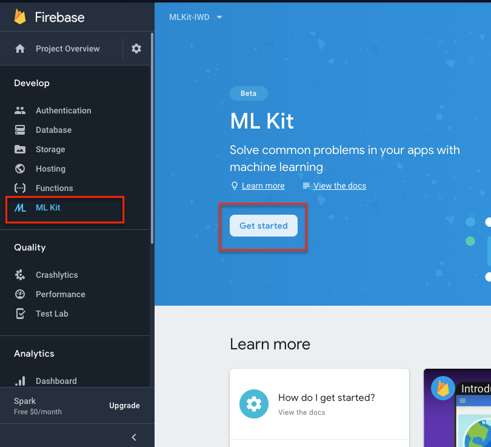
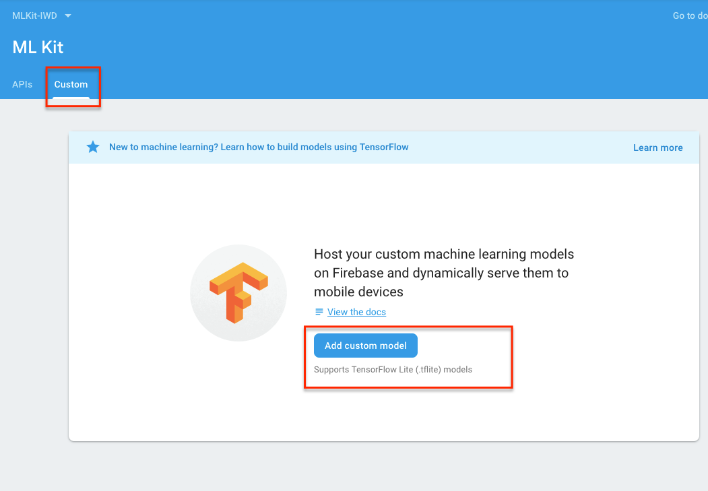

# 2. Reconocimiento de Objetos - Tensorflow

>***Nota:*** 1. Primero ingresar a [firebase](https://firebase.google.com/) 

Entrar a la opciones `ML KIT` y comenzar o Get Started



Luego ingresamos a `custom` y `add custom model` el cual nombraremos con el nombre `mobilenet_v1_224_quant`



y cuando te pida seleccionar un modelo customizable seleccionamos. `mobilenet_v1_1.0_224_quant.tflite` esperamos a que el modelo cargue y continuamos con el codigo.

### remplazar el codigo

Agregamos las siguientes instancias al comienzo del archivo `MainActivity` para definir el `FirebaseModelInterpreter.`
```
/**
* An instance of the driver class to run model inference with Firebase.
*/
private FirebaseModelInterpreter mInterpreter;
/**
* Data configuration of input & output data of model.
*/
private FirebaseModelInputOutputOptions mDataOptions;
```

### agregamos la siguiente porcion de codigo.
>***Nota:*** agregaremos el siguiente codigo dento del metodo `onCreate` al final del metodo.

```
    private void initCustomModel() {
        mLabelList = loadLabelList(this);

        int[] inputDims = {DIM_BATCH_SIZE, DIM_IMG_SIZE_X, DIM_IMG_SIZE_Y, DIM_PIXEL_SIZE};
        int[] outputDims = {DIM_BATCH_SIZE, mLabelList.size()};
        try {
            mDataOptions =
                    new FirebaseModelInputOutputOptions.Builder()
                            .setInputFormat(0, FirebaseModelDataType.BYTE, inputDims)
                            .setOutputFormat(0, FirebaseModelDataType.BYTE, outputDims)
                            .build();
            FirebaseModelDownloadConditions conditions = new FirebaseModelDownloadConditions
                    .Builder()
                    .requireWifi()
                    .build();
            FirebaseLocalModelSource localSource =
                    new FirebaseLocalModelSource.Builder("asset")
                            .setAssetFilePath(LOCAL_MODEL_ASSET).build();

            FirebaseCloudModelSource cloudSource = new FirebaseCloudModelSource.Builder
                    (HOSTED_MODEL_NAME)
                    .enableModelUpdates(true)
                    .setInitialDownloadConditions(conditions)
                    .setUpdatesDownloadConditions(conditions)  // You could also specify
                    // different conditions
                    // for updates
                    .build();
            FirebaseModelManager manager = FirebaseModelManager.getInstance();
            manager.registerLocalModelSource(localSource);
            manager.registerCloudModelSource(cloudSource);
            FirebaseModelOptions modelOptions =
                    new FirebaseModelOptions.Builder()
                            .setCloudModelName(HOSTED_MODEL_NAME)
                            .setLocalModelName("asset")
                            .build();
            mInterpreter = FirebaseModelInterpreter.getInstance(modelOptions);
        } catch (FirebaseMLException e) {
            showToast("Error while setting up the model");
            e.printStackTrace();
        }
    }
```

### remplazar el codigo

```
private void runModelInference() {
    // Replace with code from the codelab to run inference using your custom model.
}
```

por:

```
private void runModelInference() {
    if (mInterpreter == null) {
        Log.e(TAG, "Image classifier has not been initialized; Skipped.");
        return;
    }
    // Create input data.
    ByteBuffer imgData = convertBitmapToByteBuffer(mSelectedImage, mSelectedImage.getWidth(),
            mSelectedImage.getHeight());

    try {
        FirebaseModelInputs inputs = new FirebaseModelInputs.Builder().add(imgData).build();
        // Here's where the magic happens!!
        mInterpreter
                .run(inputs, mDataOptions)
                .continueWith(
                        new Continuation<FirebaseModelOutputs, List<String>>() {
                            @Override
                            public List<String> then(Task<FirebaseModelOutputs> task) {
                                byte[][] labelProbArray = task.getResult()
                                        .<byte[][]>getOutput(0);
                                List<String> topLabels = getTopLabels(labelProbArray);
                                mGraphicOverlay.clear();
                                GraphicOverlay.Graphic labelGraphic = new LabelGraphic
                                        (mGraphicOverlay, topLabels);
                                mGraphicOverlay.add(labelGraphic);
                                return topLabels;
                            }
                        });
    } catch (FirebaseMLException e) {
        e.printStackTrace();
        showToast("Error running model inference");
    }

}
```

### Final del capitulo
Ahora que terminamos el codelab solo falta que puedas hacer tus propios ejemplos.

